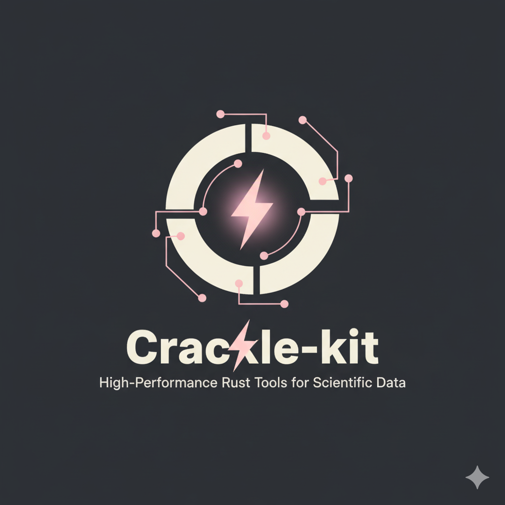

 
 
 

# Crackle Kit
A Tinkering Lab to write performant code for bioinformatics task.

## Features
### 1. Bam
1. Parallel Locus Process (For Bam file)  
    Do tasks per bam file region.

2. Producer Consumer Process  
    Read bam file, modify reads, and write a new bam file.